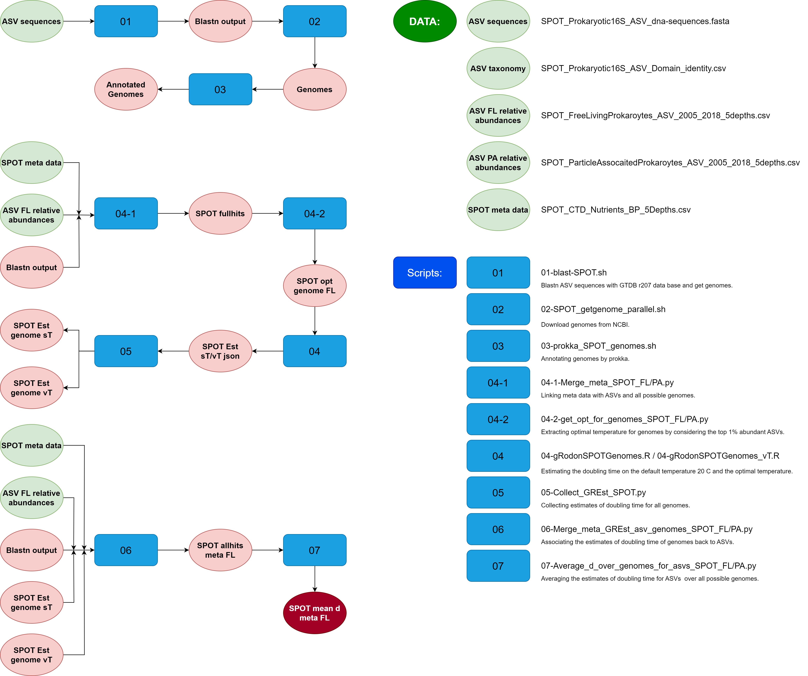

# Pipeline for SPOT project

# Output files of interest

1. **SPOT_mean_d_meta_FL.csv** provides the mean maximum growth rates for each ASV in each depth for free living prokaryotes;
2. **SPOT_mean_d_meta_PA.csv** provides the mean maximum growth rates for each ASV in each depth for particle associated prokaryotes;

Both have two estimates of the doubling time, one is the default temperature (20 &deg;C) and the other is the optimal temperature.

# Origional data files

1. **SPOT_combine_16S_18SwMetazoa_ASV_Jan2001_Aug2018_QC.csv** has the count of ASV individuals in each sample;
2. **SPOT_combine_16S_18SwMetazoa_taxonomy_Silva_PhytoRef_PR2_QC.csv** has the taxonomy of each ASV;
3. **SPOT_Metadata_Seq_Envi_QC.csv** has the metadata of each sample;
4. **SPOT_combine_16S_18SwMetazoa_ASV_dna-sequences.fasta** has the sequences of each ASV (not included in my version);
5. **spot_asv_long.csv** provides everything in one file;

# Post-processed data files

1. The file "**SPOT_Prokaryotic16S_ASV_dna-sequences.fasta**" contains ASV sequences data;

2. **SPOT_Prokaryotic16S_ASV_Table_FL.csv/SPOT_Prokaryotic16S_ASV_Table_PA.csv** provides the relative abundance of each ASV in each sample for free living and particle associated prokaryotes;

3. Blasting process used GTDB r207 "**GTDB-blastdb/220613_bac-arc-r207_merged.fna**" and produces the output file "**SPOT_Prokaryotic16S_ASV_dna-sequences_BLASToutput.tsv**";

3. The file "**SPOT_Prokaryotic16S_ASV_Domain_identity.csv**" provides taxonomy for each ASV;

# Data details

1. The file "**SPOT_Prokaryotic16S_ASV_dna-sequences.fasta**" contains 70,100 ASVs;

2. The file "**SPOT_Prokaryotic16S_ASV_dna-sequences_BLASToutput.tsv**" contains 30,418 ASVs and 22,399 unique genomes;

3. The file "**SPOT_FreeLivingProkaroytes_ASV_2005_2018_5depths.csv**" contains 72,672 ASVs;

4. The file "**SPOT_ParticleAssocaitedProkaroytes_ASV_2005_2018_5depths.csv**" contains 72,672 ASVs, the same as the free living prokaryotes ASVs. The difference is the relative abundance of each ASV at each sample; 

5. There are 4,879 ASVs in the blastn output file but not in the "**SPOT_ParticleAssocaitedProkaroytes_ASV_2005_2018_5depths.csv**" file.

6. That is to say, there are 25,539 ASVs in the blastn output file and also in the meta data file "**SPOT_ParticleAssocaitedProkaroytes_ASV_2005_2018_5depths.csv**";

7. These ASVs correspond to 21,391 unique genomes according to the blastn output file;

8. In the estimation file "**SPOT_fullhits_FL.csv**" and "**SPOT_fullhits_PA.csv**", there are in total 22,895 ASVs and 20,642 genomes.

# Methods used for getting the optimal temperature

As gRodon is a genome-based estimator, the estimation of the growth rates should be assigned to genomes/accession numbers.

So, for each genome, the optimal temperature is computed by taking the relative abundance weighted mean of the temperatures for every sample it appears in. 

To match the estimates of growth rates back to the ASVs, I just simply take the mean of the optimal temperatures for the genomes that are corresponding to the ASVs.

# Environment requirement

1. [NCBI Datasets](https://www.ncbi.nlm.nih.gov/datasets/);

2. [Prokka](https://github.com/tseemann/prokka);

3. [gRodon](https://microbialgamut.com/gRodon-vignette);

4. [R](https://www.r-project.org/);

5. [python](https://www.python.org/);

# Scripts

All the scripts named after "**sub_XXX**" are to submit jobs to the cluster.

1. "**01-blast-SPOT.sh**" compares the ASVs in the file "**SPOT_Prokaryotic16S_ASV_dna-sequences.fasta**" with GTDB r207 and produces identified genomes, "**SPOT_Prokaryotic16S_ASV_dna-sequences_BLASToutput.tsv**".

2. "**02-SPOT_getgenome_parallel.sh**" downloads full genomes according to the blast output;

3. "**03-prokka_SPOT_genomes.sh**" exploits [Prokka](https://github.com/tseemann/prokka) to annotate genomes according to the taxonomy provided for ASVs; 

4. "**04-R_CDS.sh**" substracts the untranslated coding sequences (CDS). See [gRodon documentation](https://microbialgamut.com/gRodon-vignette) for details;

5. "**04-gRodonSPOTGenomes.R**" uses gRodon package and estimate the doubling time for genomes on the default temperature (20 &deg;C) for all genomes;

6. "**04-gRodonSPOTGenomes_vT.R**" uses gRodon package and estimate the doubling time for genomes on the optimal temperature provided by the file "**SPOT_opt_genomes_FL.csv**". The optimal temperature is computed by taking the mean of the temperatures for the 1% top abundances of ASVs that are corresponding to the genome;

# Processes

1. Blastn ASVs against GTDB r207 with a percent identity 95 and a query coverage 100, -- **Script 01**;

2. Download full genomes from [NCBI](https://www.ncbi.nlm.nih.gov/) using [NCBI Datasets](https://www.ncbi.nlm.nih.gov/datasets/) -- **Script 02**;

3. Annotating genomes using [prokka](https://github.com/tseemann/prokka). The taxonomy of ASVs is provided. -- **Script 03**;

4. Applying gRodon to estimate doubling time for genomes. -- **Script 04**;

